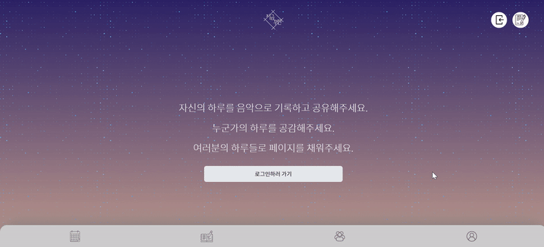
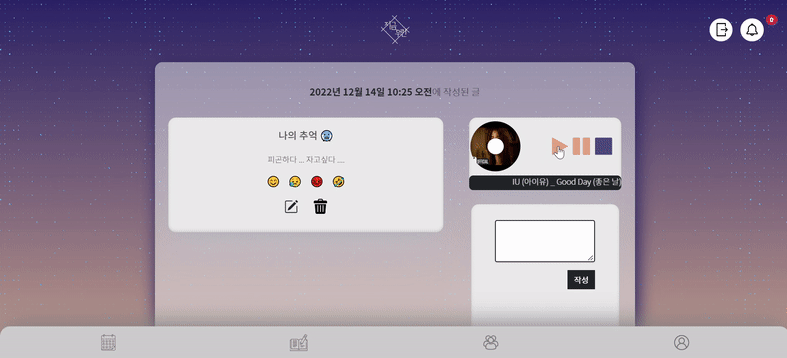
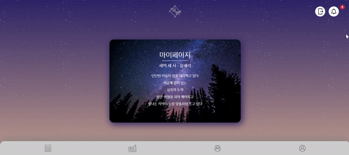

# 💌 지금, 우린

> **프로젝트명 : 지금, 우린**
> 
> **팀명 : 중요한건 꺾이지 않는 마음. (unbreakable heart.)**
> 
> **주제 : 음악과 함께하는 나만의 일기장**
> 
> **프로젝트 기간 : 11월 23일 ~ 12월 14일**

 

## 💌 '지금, 우린' 기획 의도

- 익명성을 강조한 나만의 음악 일기장
- 음악과 함께 그날의 감정을 기록하고, 타인과 그 감정을 공유함
- 유저의 입장에서 생각하고 최소한으로 필요한 기능만 구현

 

## 💌 AWS를 통한 배포

👉 **[사이트 바로가기](http://unbreakableheart-env.eba-fq3y3emz.ap-northeast-2.elasticbeanstalk.com/)**

 

## 💌 프로젝트 참여자들

`프론트엔드` : 박찬솔, 여다영

`백엔드` : 김재형, 문상희, 손희준

 

## 💌 '지금, 우린' 기능 소개

### [메인 페이지]

-   

### [일기장 CRUD]

- **생성**

-   

- **음악** 

-   

- **생성 화면**

-   

### [캘린더]

- 로그인 된 상태일 때, 자신의 캘린더를 띄움

  - 일기를 쓰지 않은 날일 때는, '작성한 일기가 없다'는 문구를 띄우고
  - 일기를 쓴 날에는, 작성한 일기들을 볼 수 있는 페이지로 넘어감

  => 비동기로 구현함

- 해당 일자의 일기들을 총 네가지로 구분하여 출력
  - 글만 있는 경우
  - 글과 사진이 있는 경우
  - 글과 노래가 있는 경우
  - 글과 사진, 노래 모두 있는 경우
- grid를 활용하여 작은 화면 일 때는 오른쪽 div가 아래로 내려가도록 함

  

### [커뮤니티]

-   

### [로그인/회원가입]

- **로그인**

- 카카오 API를 활용해서 카카오 소셜 로그인 기능 구현

- **회원가입**

- 자바스크립트를 활용해 한번에 정보를 입력받고 제출함

- 하트 색으로 단계를 나타내줌

- 입력을 덜한 채로 다음 단계를 넘어가려 하면, 박스가 빨간색으로 변함

    

### [마이페이지]

-   

- **메세지**

- 내가 받은 메시지를 선택 삭제 혹은 전체 삭제 기능 구현

- 메시지 디테일에서 메시지 내용확인 및 노래 재생 기능 구현

- 메시지 신고 기능 구현 - 3회 이상 신고 받으면 자동 정지

- 네브바에 아직 읽지 않은 메세지 수 표시 기능 구현

## 💌 사용한 기술 스택

        

 

## 💌 프로젝트 후기

- **김재형** : 서비스에 중점을 두고 진짜 서비스에 필요한 기능으로만 구성해서 지난 프로젝트들과는 다르게 진짜 서비스를 준비한다는 느낌을 받았다. 좋은 팀원들을 만나 많이 배우고 팀원들과 회의를 자주 진행한 덕에 의견 조율과 의사소통에 큰 도움이 되었다. 처음에 css파일 정리에 대한 규칙을 정하지 못한 부분 등 아쉬운 부분이 없는 건 아니지만 그럼에도 이번 프로젝트는 앞으로의 다른 프로젝트들을 함에 있어서 큰 도움이 될 거란 확신이 든다.
- **문상희** : 
- **박찬솔** : 
- **손희준** : 
- **여다영** : 우리가 개발해보고 싶은 서비스를 직접 기획하고, 그 의도에 맞추어 유저의 입장에서 생각하고 개발하여서 더욱 뜻깊었다. 최종 프로젝트인 만큼 기능을 이것저것 넣고 싶은 마음도 있었지만, 사용자가 가장 편리한 방법이 무엇일까 고민하면서 꼭 필요한 기능만 넣었던 적은 이번이 처음이었던 것 같다. 또, 앱처럼 만들고 싶다는 마음에서 반응형으로 만들고, 프론트엔드를 맡은 적은 처음이었어서 재미있었다.