# 💌 지금, 우린

.gif)

> **프로젝트명 : 지금, 우린**
>
> **팀명 : 중요한건 꺾이지 않는 마음. (unbreakable heart.)**
>
> **주제 : 음악과 함께하는 나만의 일기장**
>
> **프로젝트 기간 : 11월 23일 ~ 12월 14일**

 

## 💌 '지금, 우린' 기획 의도

- 익명성을 강조한 나만의 음악 일기장
- 음악과 함께 그날의 감정을 기록하고, 타인과 그 감정을 공유함
- 유저의 입장에서 생각하고 최소한으로 필요한 기능만 구현

 

## 💌 AWS를 통한 배포

👉 **[사이트 바로가기](http://unbreakableheart-env.eba-fq3y3emz.ap-northeast-2.elasticbeanstalk.com/)**

 

## 💌 프로젝트 참여자들

`프론트엔드` : 박찬솔, 여다영

`백엔드` : 김재형, 문상희, 손희준

 

## 💌 '지금, 우린' 기능 소개

### [메인 페이지]

-16709993051783.gif)

- 

 

### [일기장 CRUD]

- **생성**

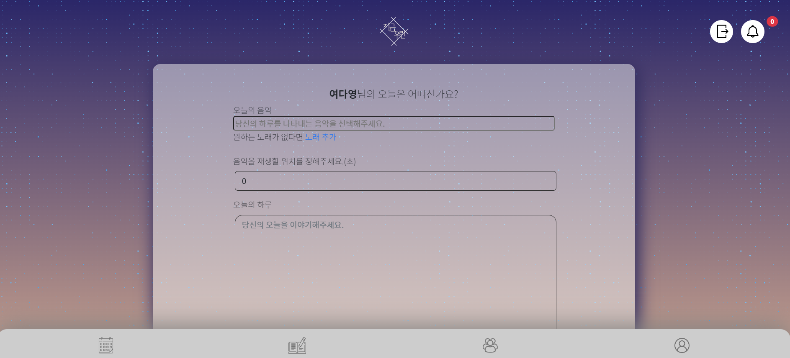

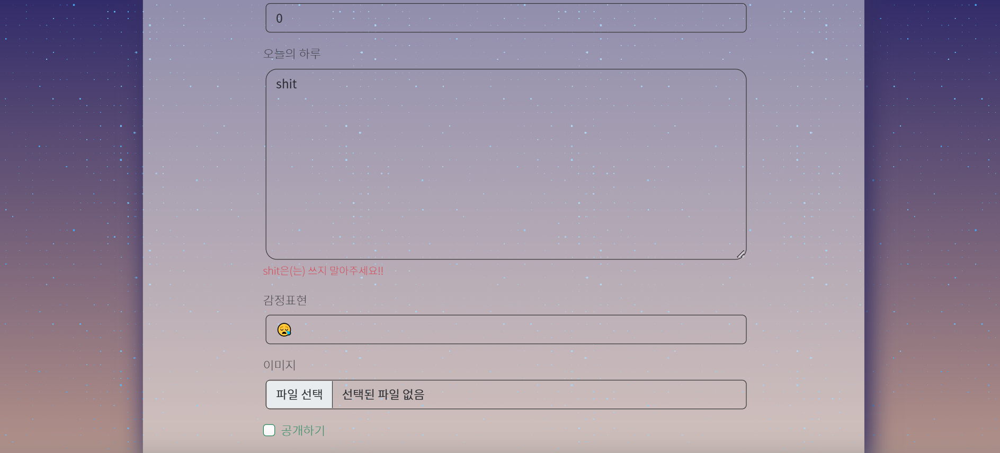

- 

 

- **음악** 

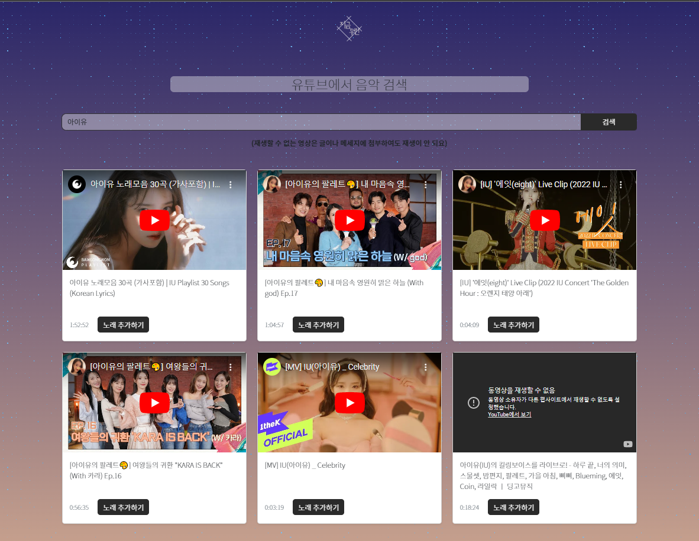

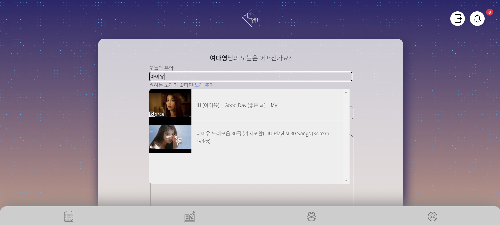

- 

 

- **생성 화면**

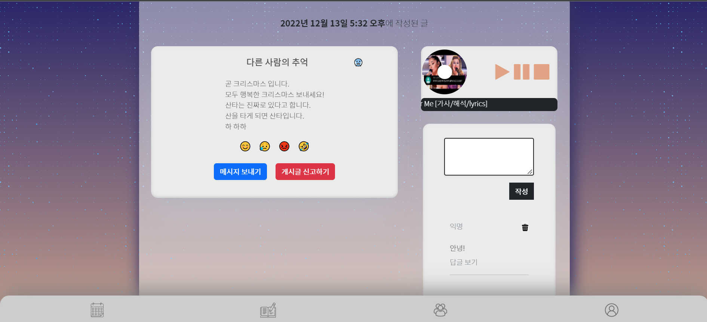

.gif)

- 

 

### [다이어리]

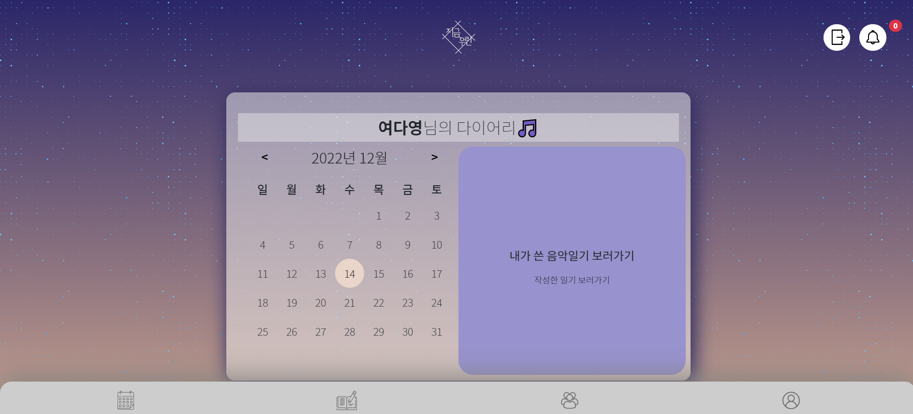

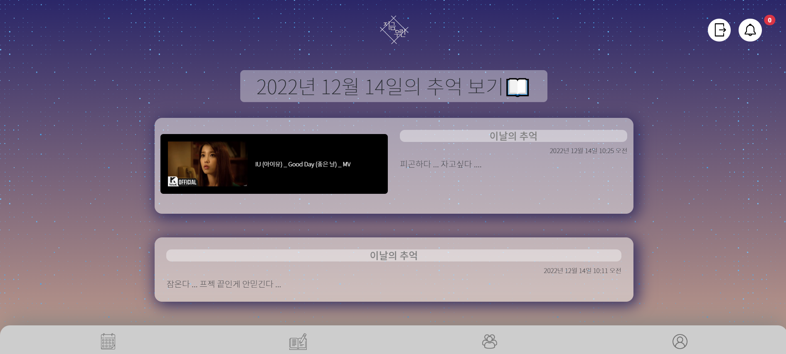

- 

 

### [커뮤니티]

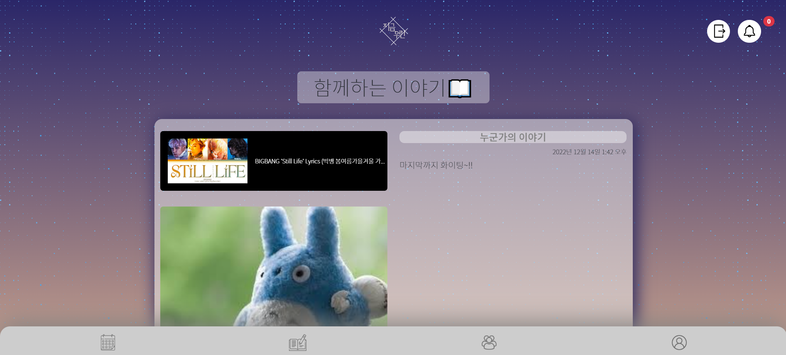

- 

 

### [로그인/회원가입]

- **로그인**

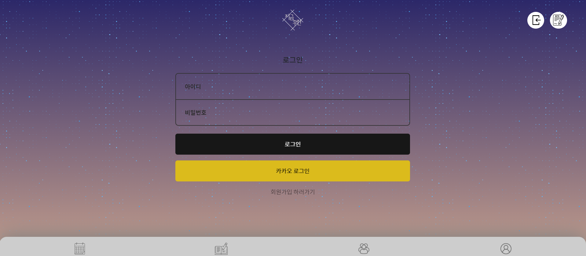

- 

 

- **회원가입**

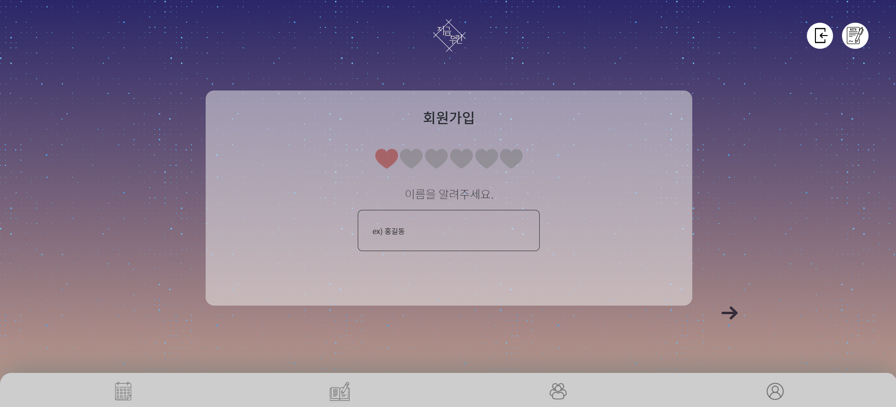

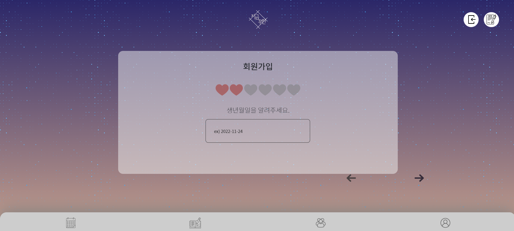

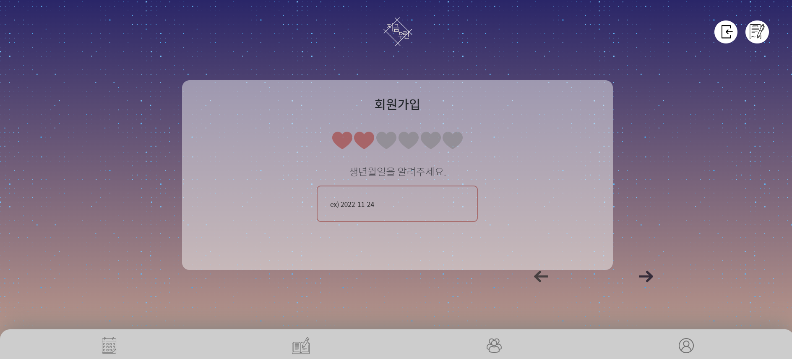

- 

 

### [마이페이지]

.gif)

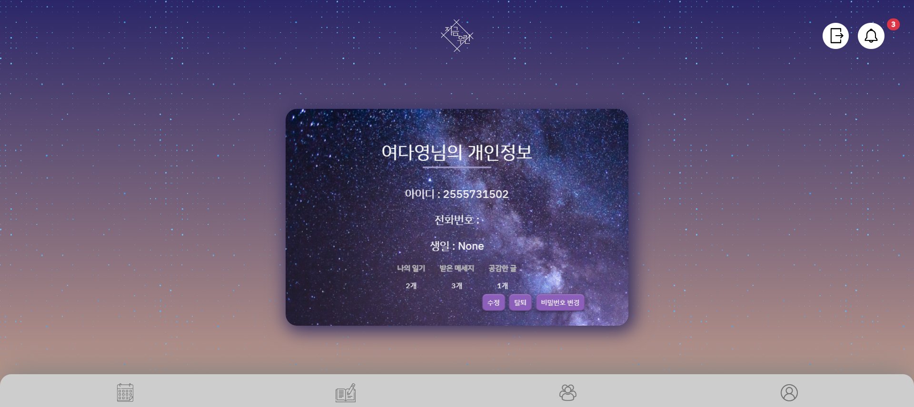

- 

 

- **메세지**

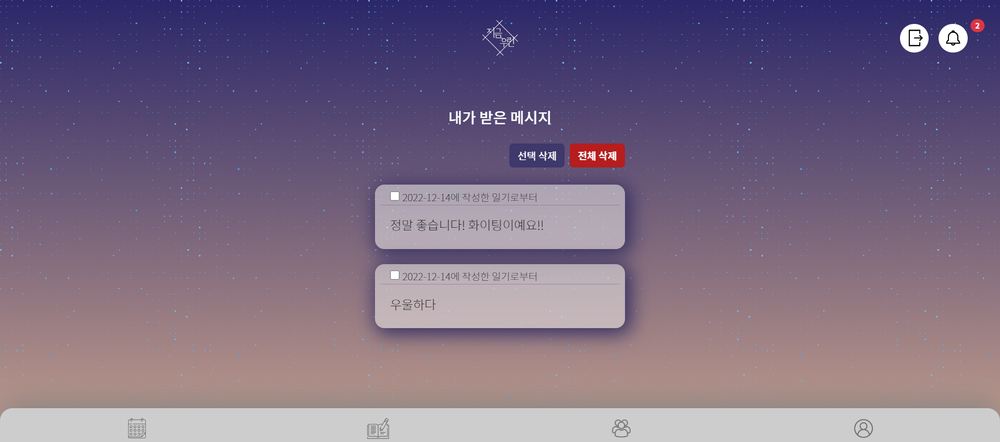

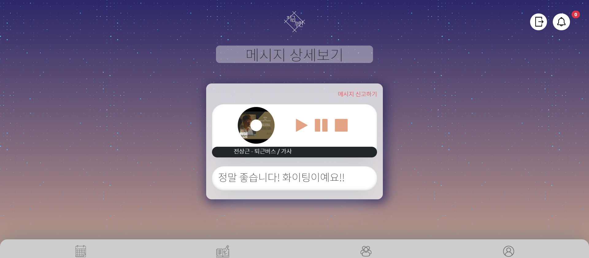

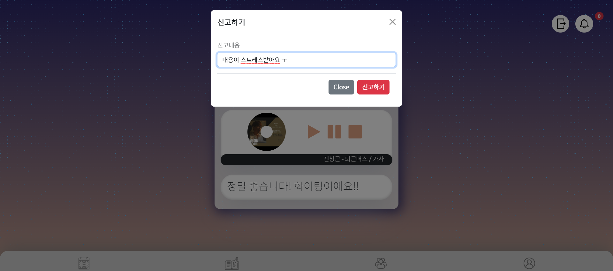

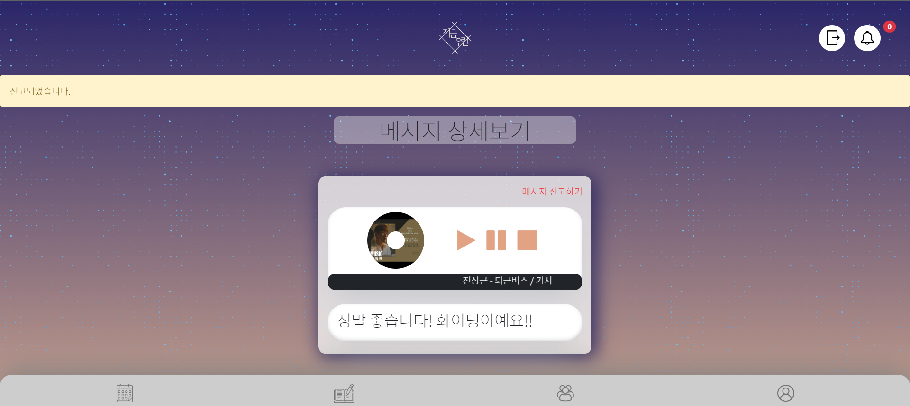

- 

 

## 💌 사용한 기술 스택

        

 

## 💌 프로젝트 후기

- **김재형** : 
-  **문상희** : 
- **박찬솔** : 
- **손희준** : 
- **여다영** : 